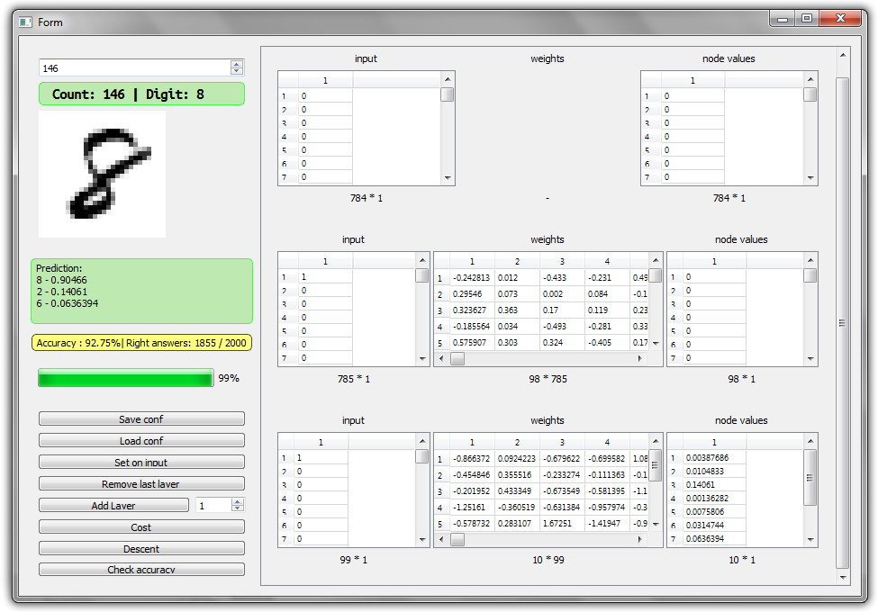

# Qt C++ Neural network with GUI
This implementation of neural network is written on C++.
It has GUI which developed with Qt framework.
This application was developed with purpose to recognition
handwritten digits which are given from
[MNIST](http://yann.lecun.com/exdb/mnist/) dataset.
Backpropagation algorithm is used for learning network and gradient
descent for minimizing cost function.

# Neural-network-Qt-C--master_okruglenie_2
форк программы Андрея Балана
Все числа с плавающей запятой заменены на свой класс RoundedDouble чётко и определённо округляющий числа с плавающей запятой до 8 цифр после запятой.
